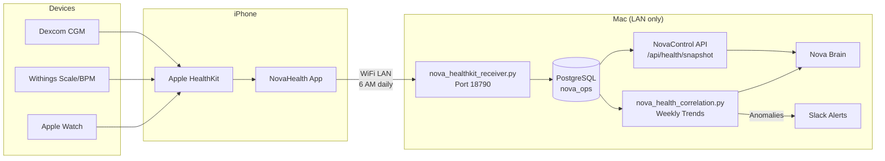
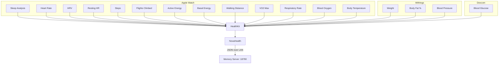

# NovaHealth — Product Overview

**The bridge between your body and your AI familiar.**

NovaHealth is a native iOS app that feeds Apple HealthKit data into Nova's local memory system. No cloud. No subscriptions. No data leaving your network. Just raw health telemetry flowing from your wrist to your AI's long-term memory — every single day, automatically.

---

## What It Does

NovaHealth reads 17 health metrics from Apple HealthKit, aggregates the previous day's data, and pushes it over your local WiFi to Nova's memory server at 6 AM every morning. Nova then correlates, trends, and alerts — all without a single byte leaving your home network.

### The 17 Metrics

| Category | Metric | Typical Source |
|----------|--------|----------------|
| Sleep | Sleep Analysis | Apple Watch |
| Cardiac | Heart Rate | Apple Watch |
| Cardiac | Heart Rate Variability (HRV) | Apple Watch |
| Cardiac | Resting Heart Rate | Apple Watch |
| Activity | Steps | Apple Watch / iPhone |
| Activity | Flights Climbed | Apple Watch / iPhone |
| Activity | Active Energy Burned | Apple Watch |
| Activity | Basal Energy Burned | Apple Watch |
| Activity | Walking + Running Distance | Apple Watch / iPhone |
| Fitness | VO2 Max | Apple Watch |
| Respiratory | Respiratory Rate | Apple Watch |
| Respiratory | Blood Oxygen (SpO2) | Apple Watch |
| Body | Body Temperature | Apple Watch |
| Body | Weight | Withings Scale |
| Body | Body Fat Percentage | Withings Scale |
| Metabolic | Blood Glucose | Dexcom CGM |
| Cardiovascular | Blood Pressure | Withings BPM |

---

## Why It Matters

Most health apps upload your data to someone else's server. NovaHealth does the opposite — it keeps everything local and feeds it to an AI that actually knows you.

- **Privacy by design** — Data travels iPhone to Mac over LAN. Never touches the internet.
- **Contextual intelligence** — Nova correlates health data with sleep, activity, weather, calendar, and mood.
- **Anomaly detection** — Weekly trend analysis flags deviations. Alerts posted to Slack.
- **Longitudinal memory** — 5-year history export for bulk backfill. Nova remembers your health trajectory.
- **Zero maintenance** — Daily push happens automatically at 6 AM. No manual sync required.

---

## Architecture

### Data Flow

### Metric Sources

---

## The Nova Ecosystem

NovaHealth is one piece of a fully local AI infrastructure:

| Component | Role |
|-----------|------|
| **nova** | The brain — reasoning, memory retrieval, conversation |
| **NovaControl** | REST API gateway — exposes all Nova capabilities on port 37400 |
| **NovaTV** | Apple TV display — ambient dashboards and notifications |
| **nova-journal** | Daily voice — auto-published writing at nova.digitalnoise.net |
| **NovaHealth** | This app — health telemetry bridge from iPhone to Nova |

NovaHealth feeds the body data. Nova connects it to everything else — your calendar, your activity patterns, your mood, your environment. The result is an AI that doesn't just know what you said — it knows how you slept, how hard your heart worked, and whether today is an outlier.

---

## Technical Specs

| Attribute | Value |
|-----------|-------|
| Version | 1.0.0 |
| Platform | iOS 16+ |
| Framework | SwiftUI |
| Test Coverage | 99 tests |
| Transport | HTTP over WiFi LAN (port 18790) |
| Data Format | JSON aggregates |
| Schedule | Daily at 6 AM (previous day) |
| Backfill | 5-year history export |
| Cloud Dependencies | None |
| Privacy | 100% local — no data leaves your network |

---

## Who This Is For

NovaHealth exists for people who:

- Want their AI to understand their physical state, not just their words
- Refuse to upload health data to third-party servers
- Already run Nova (or want to)
- Believe health insights require longitudinal data, not just today's snapshot
- Own an Apple Watch and want that data to actually go somewhere useful

---

## The Privacy Guarantee

NovaHealth makes exactly one network call: a JSON POST to a Python server on your own Mac, over your own WiFi. That's it.

- No analytics SDK
- No crash reporting to third parties
- No account creation
- No server authentication (LAN trust model)
- No App Store (direct distribution)
- No telemetry of any kind

Your health data stays in your house. Period.

---

*Built by Jordan Koch as part of the Nova ecosystem.*
*MIT License.*
