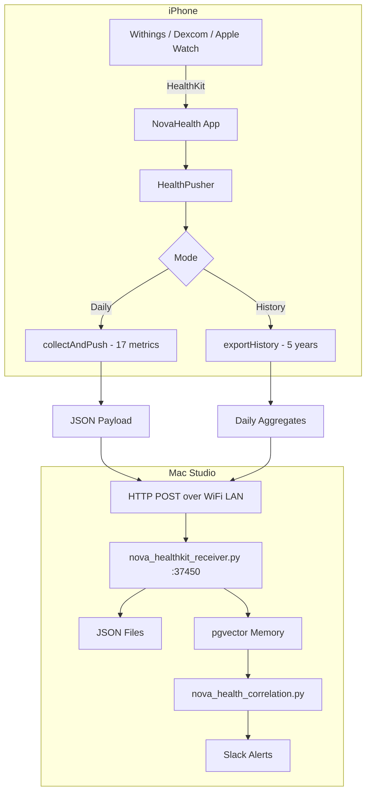
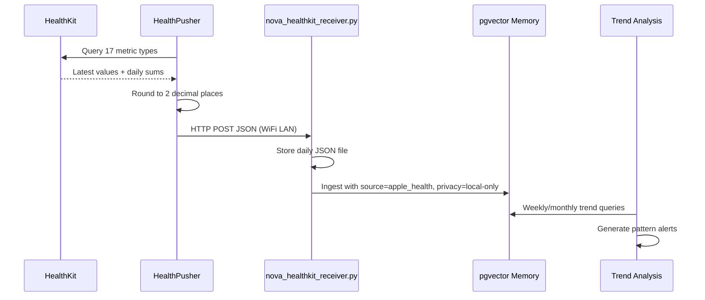

# NovaHealth

[](LICENSE)


**iPhone HealthKit to Nova bridge.** Reads 17 health metrics from HealthKit and pushes them to Nova's local memory server on your Mac. All data stays on your local network -- nothing touches the cloud.

Written by Jordan Koch.

---

## Architecture



### Data Flow



---

## Metrics

NovaHealth reads **17 metric types** from HealthKit:

| Metric | Unit | Sources |
|---|---|---|
| Heart Rate | bpm | Withings, Apple Watch |
| Resting Heart Rate | bpm | Apple Watch, Withings |
| Heart Rate Variability (SDNN) | ms | Apple Watch, Withings |
| Blood Pressure (systolic) | mmHg | Withings BPM Connect |
| Blood Pressure (diastolic) | mmHg | Withings BPM Connect |
| Blood Glucose | mg/dL | Dexcom G6, Dexcom G7 |
| Weight | lbs | Withings Body+ |
| Body Fat | % | Withings Body+ |
| SpO2 | % | Withings, Apple Watch |
| Steps | count | iPhone, Apple Watch |
| Active Energy | kcal | iPhone, Apple Watch |
| Basal Energy | kcal | iPhone, Apple Watch |
| Distance (walking/running) | miles | iPhone, Apple Watch |
| Flights Climbed | count | iPhone |
| Body Temperature | F | Withings Thermo |
| Respiratory Rate | /min | Apple Watch |
| Sleep | hours | Withings Sleep, Apple Watch |

---

## Features

### Daily Push

Automatic background refresh at ~6:00 AM pushes today's health snapshot. Also available on-demand via the **Push Now** button.

### History Export

One-tap **Export History** sends up to 5 years of daily aggregated data to Nova's memory server. Each metric type exported sequentially, grouped by day, with sample counts.

### Minimal UI

Single screen showing:
- HealthKit authorization status
- Last push time and metric count
- Latest data values with formatted units
- Push Now and Export History buttons

No tracking. No analytics. No accounts.

---

## Requirements

- iPhone running iOS 16.0+
- Mac running Nova with `nova_healthkit_receiver.py` on port 37450
- Both devices on the same local network
- HealthKit data sources (Withings, Dexcom, Apple Watch, etc.)

## Installation

NovaHealth is sideloaded via Xcode -- not distributed through the App Store.

```bash
cd /Volumes/Data/xcode/NovaHealth
open NovaHealth.xcodeproj
# Connect iPhone, select device target, Cmd+R
```

On first launch, grant HealthKit read access to all requested categories.

### Mac-Side Receiver

```bash
python3 ~/.openclaw/scripts/nova_healthkit_receiver.py
# Listens on 0.0.0.0:37450 for iPhone WiFi access
```

Stores daily JSON files at `~/.openclaw/private/health/YYYY-MM-DD.json` with 0600 permissions.

---

## Configuration

The Mac's IP address is set in `HealthPusher.swift`:

```swift
private let serverURL = "http://192.168.1.6:37450/health"
```

Update if your Mac's local IP changes.

---

## Privacy

- **All data stays on your local network** -- iPhone pushes directly to Mac over WiFi
- **No cloud services** -- no Apple Health sharing, no third-party APIs
- **Vector memories tagged `privacy: local-only`** -- excluded from cloud-routed LLM prompts
- **Health files stored with 0600 permissions** -- only your user account can read
- **Read-only HealthKit access** -- the app never writes to HealthKit

---

## Test Suite

99 tests covering unit, security, formatting, and integration.

```bash
xcodebuild -scheme NovaHealth -destination "generic/platform=iOS" test
```

| Category | Tests | Description |
|---|---|---|
| HealthPusher Core | 12 | Singleton, initial state, rounding, metric keys, snake_case |
| ContentView Formatting | 19 | Key formatting, value formatting (all 17 types), time ago |
| Security | 16 | Local URL, no cloud, no PII, port range, timeout, privacy |
| HKUnit Extension | 1 | beatsPerMinute unit |
| Frame/Smoke | 51 | Comprehensive coverage of all model paths |

---

## License

MIT License -- Copyright 2026 Jordan Koch

See [LICENSE](LICENSE) for the full text.

---

Written by Jordan Koch ([@kochj23](https://github.com/kochj23))
