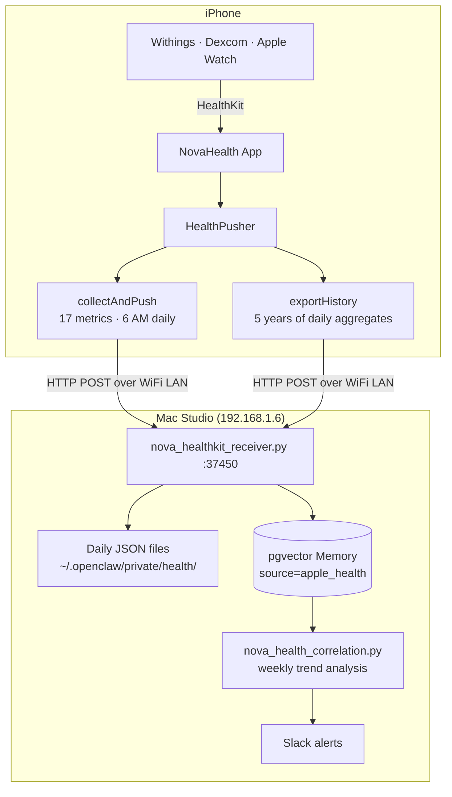
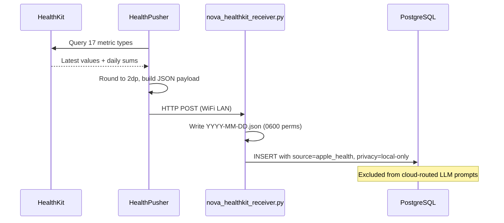

# NovaHealth

[](LICENSE)


**iPhone HealthKit to Nova bridge.** Reads 17 health metrics from HealthKit and pushes them to Nova's local memory server on your Mac. All data stays on your local network — nothing touches the cloud.

Written by Jordan Koch.

---

## Architecture



### Daily Push Flow



---

## Metrics

17 metric types from HealthKit:

| Metric | Unit | Sources |
|--------|------|---------|
| Heart Rate | bpm | Withings, Apple Watch |
| Resting Heart Rate | bpm | Apple Watch, Withings |
| Heart Rate Variability (SDNN) | ms | Apple Watch, Withings |
| Blood Pressure (systolic) | mmHg | Withings BPM Connect |
| Blood Pressure (diastolic) | mmHg | Withings BPM Connect |
| Blood Glucose | mg/dL | Dexcom G6/G7 |
| Weight | lbs | Withings Body+ |
| Body Fat | % | Withings Body+ |
| SpO2 | % | Withings, Apple Watch |
| Steps | count | iPhone, Apple Watch |
| Active Energy | kcal | iPhone, Apple Watch |
| Basal Energy | kcal | iPhone, Apple Watch |
| Distance (walking/running) | miles | iPhone, Apple Watch |
| Flights Climbed | count | iPhone |
| Body Temperature | °F | Withings Thermo |
| Respiratory Rate | /min | Apple Watch |
| Sleep | hours | Withings Sleep, Apple Watch |

---

## Features

**Daily Push** — Automatic background refresh at ~6 AM. Also available on-demand via Push Now.

**History Export** — One tap sends up to 5 years of daily aggregated data to Nova's memory server.

**Minimal UI** — Single screen: authorization status, last push time, latest values, two buttons.

---

## Requirements

- iPhone running iOS 16.0+
- Mac running Nova with `nova_healthkit_receiver.py` on port 37450
- Both devices on the same local network
- HealthKit data sources (Withings, Dexcom, Apple Watch, etc.)

---

## Installation

Sideloaded via Xcode — not on the App Store.

```bash
cd /Volumes/Data/xcode/NovaHealth
open NovaHealth.xcodeproj
# Connect iPhone, select device target, Cmd+R
```

**Mac-side receiver:**
```bash
python3 ~/.openclaw/scripts/nova_healthkit_receiver.py
# Listens on 0.0.0.0:37450 for incoming iPhone data
```

**Configuration** — set the Mac IP in `HealthPusher.swift`:
```swift
private let serverURL = "http://192.168.1.6:37450/health"
```

---

## Privacy

- All data stays on your local network — iPhone pushes directly to Mac over WiFi
- No cloud services, no third-party APIs
- Vector memories tagged `privacy: local-only` — excluded from all cloud-routed LLM prompts
- Health files stored with `0600` permissions
- Read-only HealthKit access — never writes to HealthKit

---

## Testing

99 tests covering unit, security, formatting, and integration.

```bash
xcodebuild -scheme NovaHealth -destination "generic/platform=iOS" test
```

| Category | Tests | Description |
|----------|-------|-------------|
| HealthPusher Core | 12 | Singleton, rounding, metric keys |
| ContentView Formatting | 19 | Key/value formatting for all 17 types, time-ago display |
| Security | 16 | Local URL only, no cloud, no PII, port range, timeout |
| HKUnit Extension | 1 | beatsPerMinute unit |
| Frame/Smoke | 51 | Comprehensive model path coverage |

---

## License

MIT License — Copyright 2026 Jordan Koch

See [LICENSE](LICENSE) for the full text.

Written by Jordan Koch ([@kochj23](https://github.com/kochj23))
